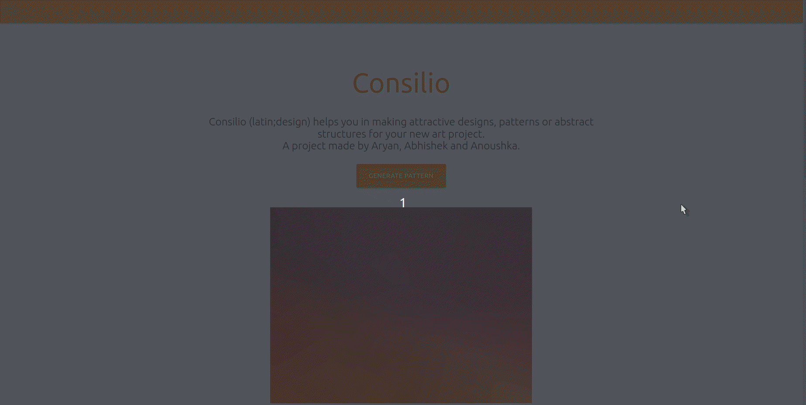
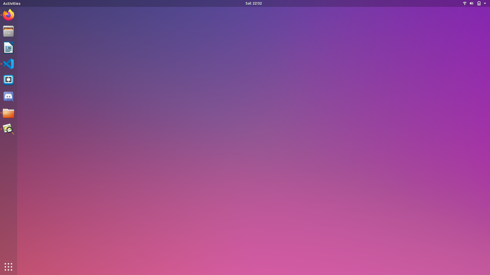

# Consilio
Cool designs for Album Arts, Desktop Background, Tshirts, Book covers and much more...
## Motivation
Often individuals find themselves in a pickle trying to figure out the perfect pattern for their merchandise and are unable to afford graphic designers for their needs. With this project we wish to deploy a web app capable of providing unique amazing designs and patterns completely free of charge.
## Requirements
Python 3.8 or above with all [requirements](requirements.txt) dependencies installed. To install run:
```python
$ pip install -r requirements.txt
```
## To run
```python
$ python app.py
```
## Tutorial
Use our random pattern generator (for now) to generate unique patterns and download them. No need to worry about copyrights cause we work Stochastically :)

## Examples
</br>
</br>

## To do
- [ ] Provide more complex patterns by tweaking CPPN.py
- [ ] Provide a light Neural Style Transfer program to further add the features (already in works)
- [ ] Deploy
---
By: [Anoushka Halder](https://github.com/anoushka-h) , [Abhishek Saxena](https://github.com/saxenabhishek) and [Aryan Kargwal](https://github.com/aryankargwal)
